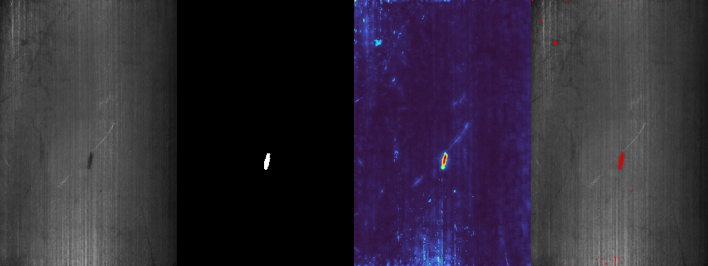
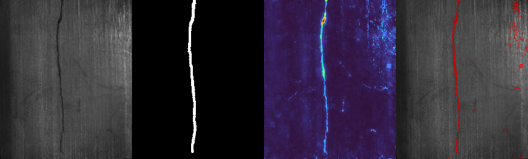
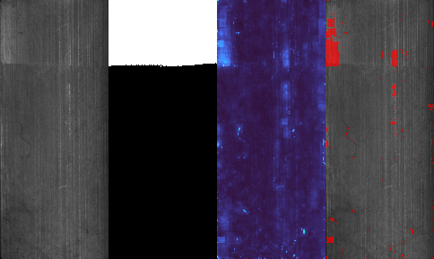

# Modern MCue Saliency Reproduction for Magnetic Tile Defect Detection

This repository is a modern, runnable reimplementation of the core saliency-based defect detection logic from the original C++ toolbox by Yibin Huang et al.

It translates a legacy `VS2013 + OpenCV 3.1` workflow into a lightweight Python pipeline that can:

- reproduce the main `MCue` feature-fusion idea
- run directly on the authors' magnetic-tile dataset structure
- export saliency maps, binary masks, side-by-side visualizations, and summary metrics
- support reproducible demos, group-meeting presentations, and follow-up experiments on a modern environment

## Project Scope

This repository is **not** the original toolbox. It is an independent reimplementation based on the logic in these upstream repositories:

- Original saliency toolbox: [abin24/Saliency-detection-toolbox](https://github.com/abin24/Saliency-detection-toolbox)
- Original magnetic-tile dataset: [abin24/Magnetic-tile-defect-datasets.](https://github.com/abin24/Magnetic-tile-defect-datasets.)

Please cite and acknowledge the original authors when using the underlying method or dataset in academic work.

## Method Summary

The Python pipeline keeps the main fusion structure from `McueSalTest.cpp`:

- darker-defect prior from adaptive thresholding
- structural-tensor saliency cue
- `PHOT` frequency-domain cue
- `AC` local color-rarity cue
- `BMS` boolean-map cue
- `MCue` and `MCue2` style feature fusion

This is a practical modern port for reproducibility and experimentation, not a bitwise-identical rebuild of the original Windows executable.

## Repository Layout

```text
.
├─ modern_saliency_pipeline.py
├─ requirements.txt
├─ results/
│  ├─ sampled_summary.json
│  └─ panels/
│     ├─ blowhole_best.png
│     ├─ crack_example.png
│     └─ uneven_hard_case.png
```
```

Key files:

- [`modern_saliency_pipeline.py`](./modern_saliency_pipeline.py): main saliency pipeline and evaluation script
- [`requirements.txt`](./requirements.txt): Python dependencies
- [`results/sampled_summary.json`](./results/sampled_summary.json): summary from the sampled run

## Installation

```bash
python -m pip install -r requirements.txt
```

## Dataset Setup

This repository intentionally does **not** redistribute the full dataset.

Clone the original dataset repository into the project root:

```bash
git clone https://github.com/abin24/Magnetic-tile-defect-datasets. git-magnetic-tile-datasets
```

Expected structure:

```text
git-magnetic-tile-datasets/
  MT_Blowhole/
    Imgs/
  MT_Break/
    Imgs/
  MT_Crack/
    Imgs/
  MT_Fray/
    Imgs/
  MT_Free/
    Imgs/
  MT_Uneven/
    Imgs/
```

Inside each `Imgs/` folder:

- `.jpg` is treated as the input image
- same-name `.png` is treated as the pixel-level mask

## Reproducibility Workflow

### 1. Run a sampled benchmark

```bash
python modern_saliency_pipeline.py \
  --dataset-root git-magnetic-tile-datasets \
  --output-root outputs/mcue_modern \
  --limit-per-class 4
```

This exports:

- per-image cue maps
- final saliency maps
- thresholded masks
- side-by-side qualitative panels
- `summary.csv` and `summary.json`

### 2. Scale to a larger run

Increase `--limit-per-class`, or remove it entirely to process more of the dataset.

## Sampled Results

The included sampled run covers 24 images total, using 4 images from each of 6 classes.

Sample overall metrics:

- `F1`: `0.165`
- `IoU`: `0.104`
- `MAE`: `0.091`

Qualitatively, the current port works better on `Blowhole` and `Crack`, while `Uneven` and `Fray` remain harder because the saliency response can spread into textured background regions.

## Qualitative Showcase

Blowhole example:



Crack example:



Uneven hard case:



Each panel shows:

`input image | ground-truth mask | predicted saliency map | thresholded overlay`

## References

If this project is useful for your work, please also refer to the original sources:

1. Huang et al., original saliency toolbox implementation and associated paper on magnetic-tile surface defects.
2. Zhang and Sclaroff, Boolean Map Saliency (`BMS`), as referenced by the original toolbox.
3. The public magnetic-tile dataset released by the original authors.

## Notes

- This repository excludes the full dataset, the original upstream C++ repository, and temporary runtime artifacts.
- The current evaluation uses Otsu thresholding on the predicted saliency map to obtain a binary mask.
- For stronger benchmarking, consider threshold sweeps, continuous saliency metrics, and larger-scale runs on a remote server.
